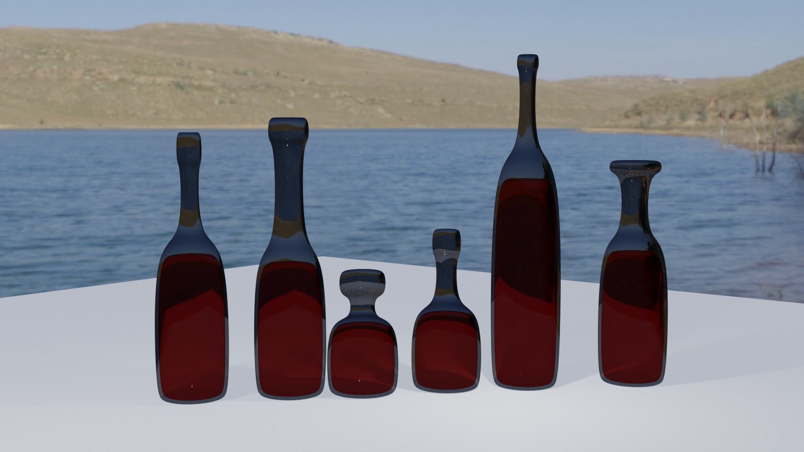

# Blender-Bottle-Builder
Sets of scripts for generating procedural 3D bottles done in Blender using Python. 
Useful demonstration of the basics of how to work with materials in Python as well as switch between 
active objects when generating multiple.

## Running instructions
1. Copy the contents of the bottle_builder script
2. Open the Blender software, 
3. Open the scripting tab inside of Blender
4. Create new text file in Blender
5. Paste the script contents
6. Click run script, keep clicking until you have the desired amount of bottles
